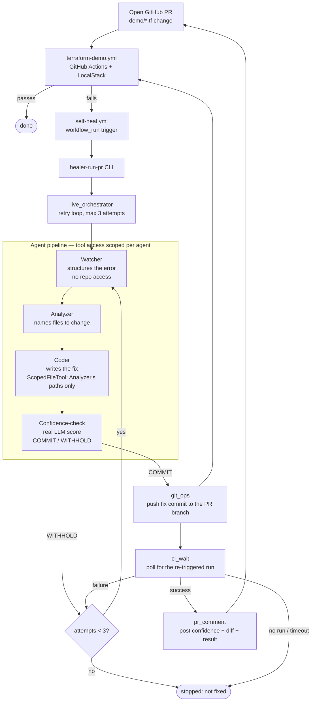

# Terraform Self-Healer

A CI/CD pipeline that automatically fixes bugs in Terraform modules for AWS infrastructure on real GitHub PRs — not a synthetic demo, it runs against this repo's own `demo/` module and pushes real fix commits to real PRs.

Built around a small team of narrowly-scoped agents and the [12-factor-agents](https://github.com/humanlayer/12-factor-agents) principles: explicit control flow (an LLM never decides handoffs), stateless/resumable retry state, and per-agent file access enforced at the tool layer rather than by prompting.

## How it works

```
Watcher → Analyzer → Coder → Confidence-check
```

1. **Watcher** structures a raw `terraform apply` error. No repo access.
2. **Analyzer** diagnoses the problem and names the exact files that need to change.
3. **Coder** implements the fix — its tool access is programmatically restricted to only the paths the Analyzer named.
4. **Confidence-check** makes a real LLM judgment call — given the diagnosed error, the Analyzer's file list, the patch diff, and retry history — and decides whether to commit the fix onto the MR under review, or hold back. Two deterministic pre-checks short-circuit this without an LLM call: an empty patch, or an exact repeat of a diff that already failed a prior attempt.

Capped at 3 retry attempts per PR, with the failing CI's own error output fed back into the next attempt.

## Automatic, end to end

The whole thing runs on its own. When a PR's CI fails, `.github/workflows/self-heal.yml` fires automatically, runs the agent pipeline against that PR, and — if Confidence-check commits — pushes the fix as a new commit onto the same PR, re-triggering its CI, and posts a structured comment with the confidence score, reasoning, the suggested diff, and the CI outcome. No polling loop, no manual step.

## System diagram



## GitHub Actions integration

`.github/workflows/self-heal.yml` triggers on `workflow_run` whenever `terraform-demo.yml` completes with `conclusion == 'failure'` on a PR. It runs `healer-run-pr <owner> <repo> <pr_number> --allow-push`, which resolves the failing PR into a `LiveCase` and calls `live_orchestrator.run_live()`.

Needs two repo secrets:
- `ANTHROPIC_API_KEY`
- `HEALER_GITHUB_TOKEN` — a personal access token, **not** the default Actions-injected `GITHUB_TOKEN`. GitHub deliberately blocks the default token from re-triggering downstream workflow runs on its own pushes, which would silently break the fix-and-recheck loop this whole feature depends on.

When Confidence-check commits a fix, the pipeline posts a structured comment on the PR: the confidence score and the LLM's reasoning, the suggested fix as a diff, and the CI outcome once known. A `WITHHOLD` outcome posts nothing — a comment implies a real fix was attempted, and there's no way to word one that distinguishes "genuinely nothing to fix" from "something went wrong internally" (see the 2026-08-28 amendment in [`02-architecture.md`](docs/plans/terraform-self-healer/02-architecture.md) for what prompted that).

## Design docs

The design history — architecture, program design, and the slice-by-slice build log with what's genuinely verified vs. still mocked — lives in [`docs/plans/terraform-self-healer/`](docs/plans/terraform-self-healer/), following a gate-based workflow (`00-status.md` is the live index; it also notes where an earlier eval-harness design was cut in favor of this simpler pipeline). [`CLAUDE.md`](CLAUDE.md) is the project brief.

## Running it

```bash
python3 -m venv .venv && .venv/bin/pip install -e .
.venv/bin/pytest -q

# live mode, read-only (no writes, safe to run anytime)
.venv/bin/python -m healer.live.live_watcher <owner> <repo>

# live mode against one specific PR — what self-heal.yml runs automatically
.venv/bin/healer-run-pr <owner> <repo> <pr_number> --run-id demo --allow-push
```
